# Что такое словарь и зачем он нужен в 16-м задании?

Словарь это такой же список, но все его элементы хранятся в виде пары "ключ:значение"

```python
f = {'name':'Artem', 'age':11, 14.1:True}
```
Чтобы вывести значение, необходимо вызвать ключ 
например:
```
f['age'] --> 11
f[14.1] --> True
```

Чтобы добавить в словарь новую пару, это можно сделать так:
```
f['новый ключ'] = 67
```
После этого в словарь добавится еще одна пара
```python
f = {'name':'Artem', 'age':11, 14.1:True,'новый ключ':67}
```

## Как решать задание №16?
Важно!  Словари не помогут решать это задание быстро, это всего лишь альтернативный способ.
За непониманием чаще всего кроются проблемы.

Пример задания:
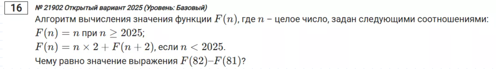

Решение с ошибкой:
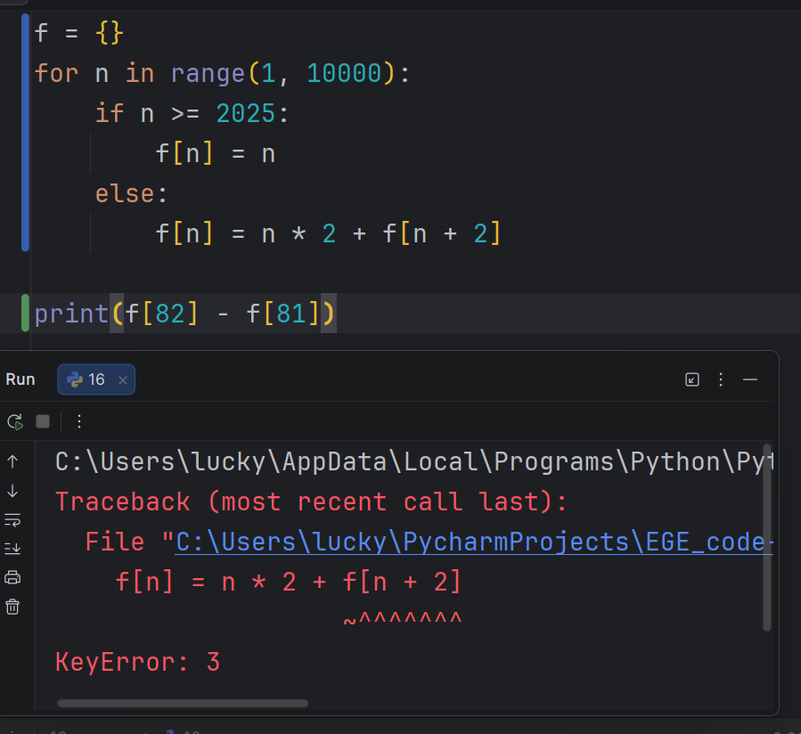

Почему эта ошибка возникает?
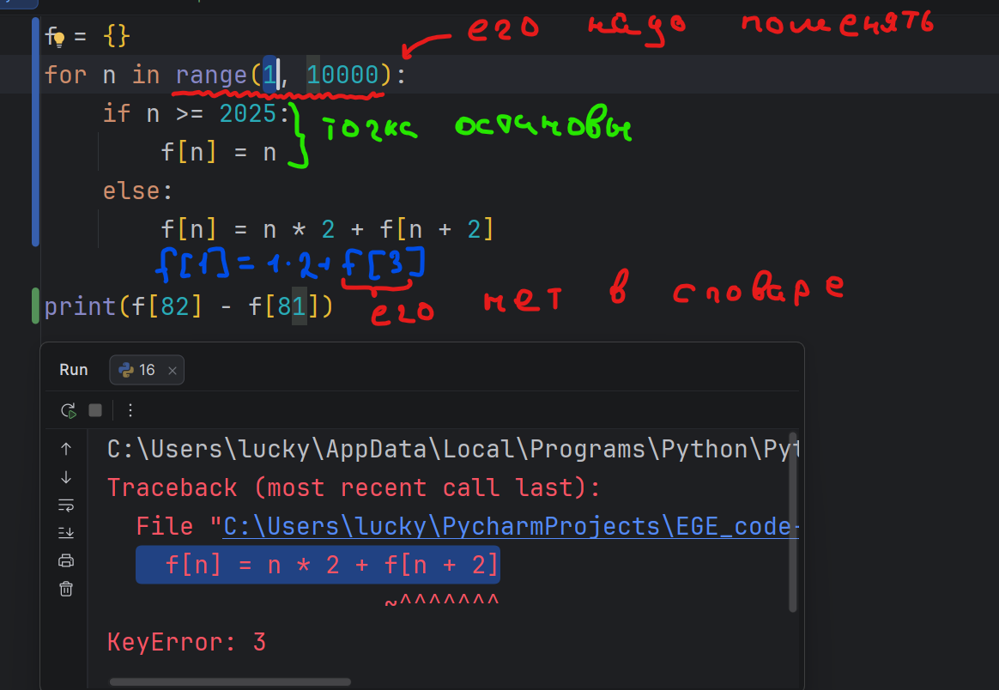
Первым элементом n из цикла for будет единица,
будет выполнено условие else и в словарь мы положим следующее:
```
f[1] = 1*2 + f[3] 
```
Но мы не знаем элемент по ключу 3, так как он будет создан позже
и из-за этого и возникает ошибка.
Чтобы ее исправить нам сначада надо заполнить словарь значениями, а потом вызывать рекурсию.

Решение без ошибки:

Для этого нам нужно продумать от какого числа запускать цикл for.
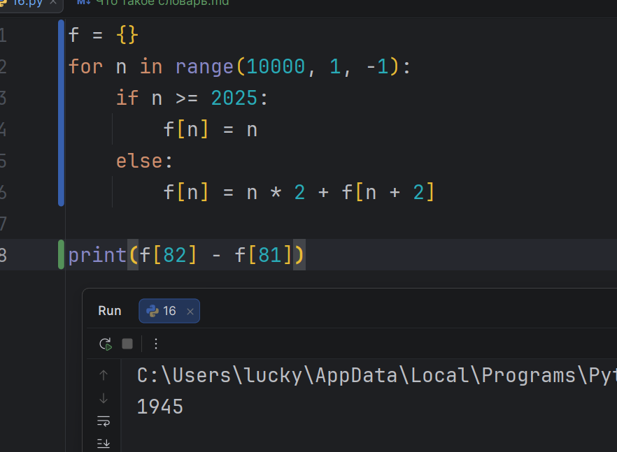

Код:
```python
f = {}
for n in range(10000, 1, -1):
    if n >= 2025:
        f[n] = n
    else:
        f[n] = n * 2 + f[n + 2]

print(f[82] - f[81])
```
Еще одно задание:
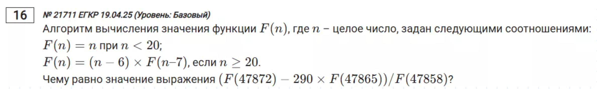
Решение:
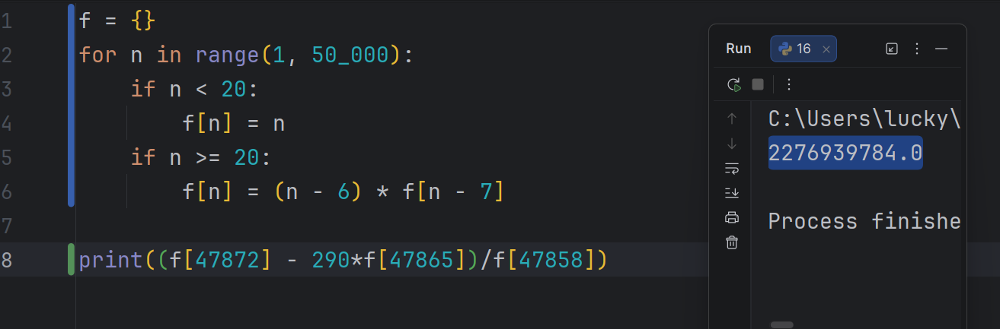

```python
f = {}
for n in range(1, 50_000):
    if n < 20:
        f[n] = n
    if n >= 20:
        f[n] = (n - 6) * f[n - 7]

print((f[47872] - 290*f[47865])/f[47858])
```

## А как решать задание с двумя функциями?

Так же)

Просто надо будет создать разные циклы для каждой функции и подумать какую мы заполняем раньше.

Пример задания на две функции:
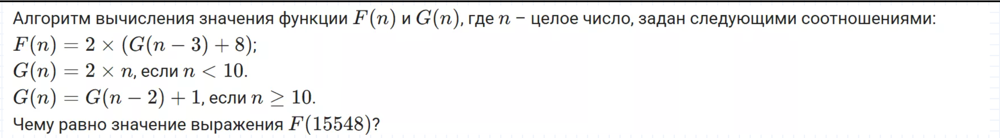

Проблема с ключом:
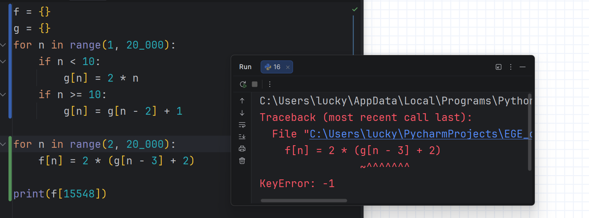
В 16-м задании важно продумать откуда запускаем циклы,
и из-за этого ключ **-1** не найден

Исправить это можно так:
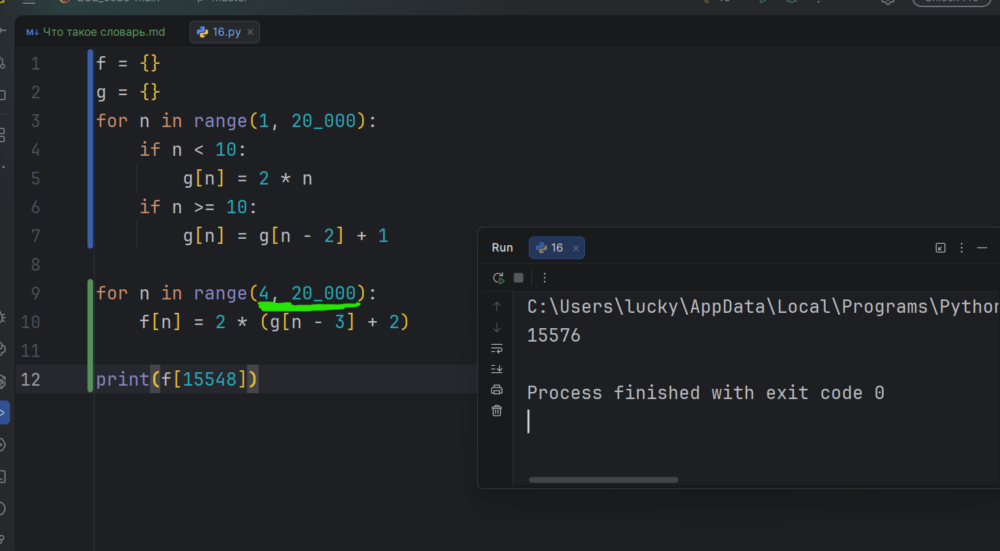

Пример еще одного задания на две функции:
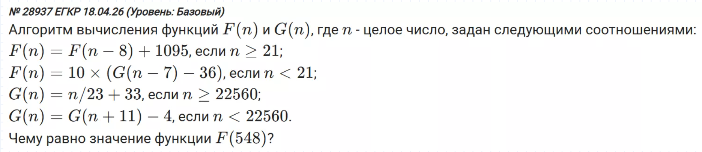
Решение:
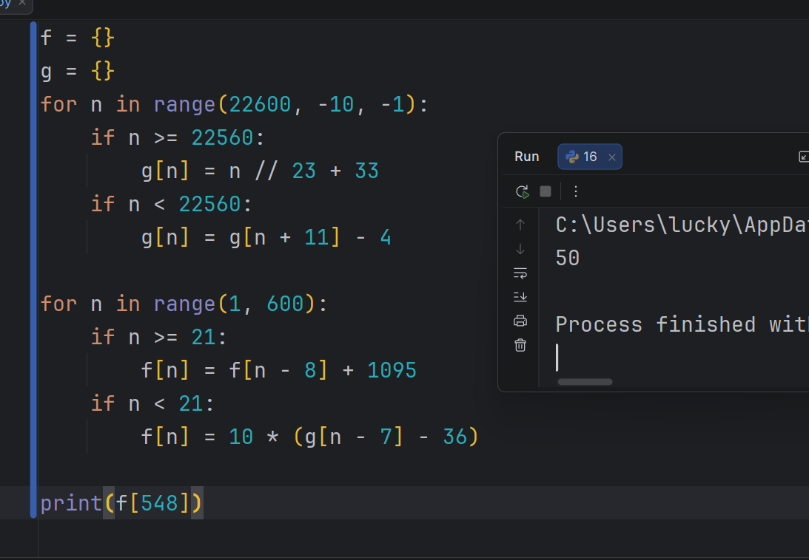