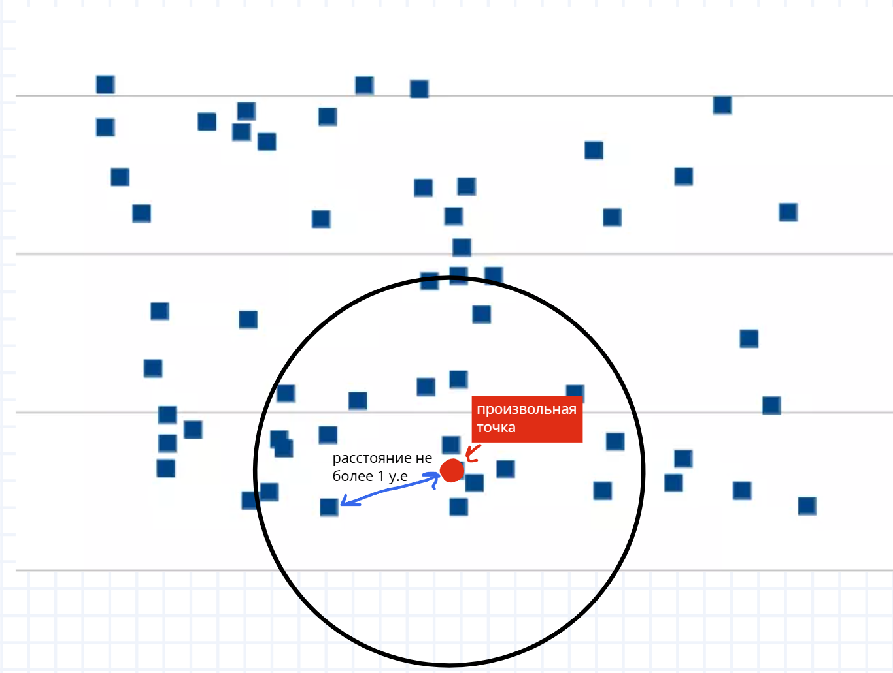
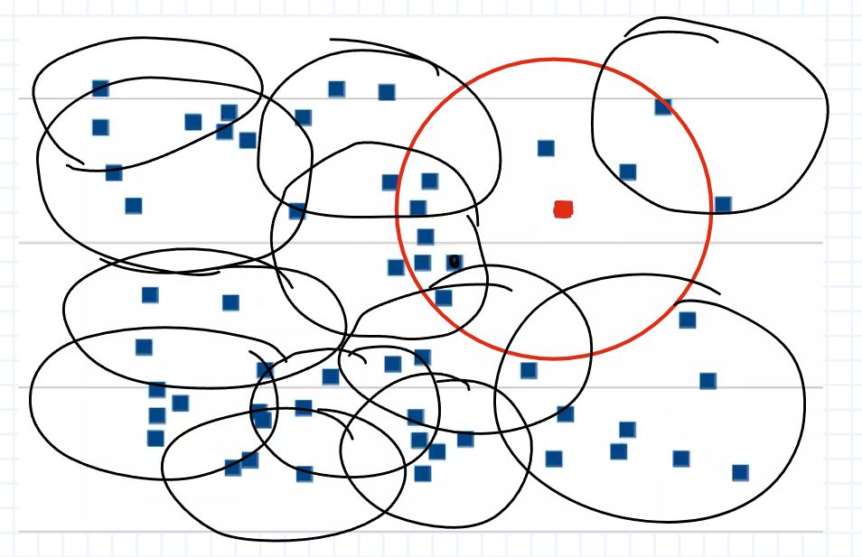

# Кластеризация путем DB-scan

Идея заключается в том, что мы берем
произвольную точку из файла и для нее собираем мини-кластер

Этот кластер будет содержать в себе звезды, которые расположенны
на растоянии не более 1 у.е.


И для каждой точки этого мини-кластера
собираем свой кластер аналогично первому.


Идея супер простая.

## Реализуем алгоритм:

```python
from math import dist
data = [[0,0], [1, 1], [2, 2]] # список кординат звезд из файла

def get_cluster(p0): # функция кластеризации от случайной точки
    cluster = [p for p in data if dist(p0, p) <= 1] # звезды в радиусе 1 у.е
    if cluster:
        for p in cluster: # если кластер сущ, то удалем точки из файла чтобы не дублировать!!!
            data.remove(p)
        new_clusters = [get_cluster(p) for p in cluster] # список всех мини-кластеров (рис 2).
        cluster += sum(new_clusters, []) # собираем все в 1 большой кластер
    return cluster
```

##  sum(new_clusters, []) Что это?

```python
a = [[1, 2, 3], [4, 5, 6], [7, 8, 9]] # вот бы все это объединить в один список
b = sum(a, []) #  каждый элемент списка "а" мы будем склеивать в []
# и в итоге мы получим список
b = [1, 2, 3, 4, 5, 6, 7, 8, 9] 
```